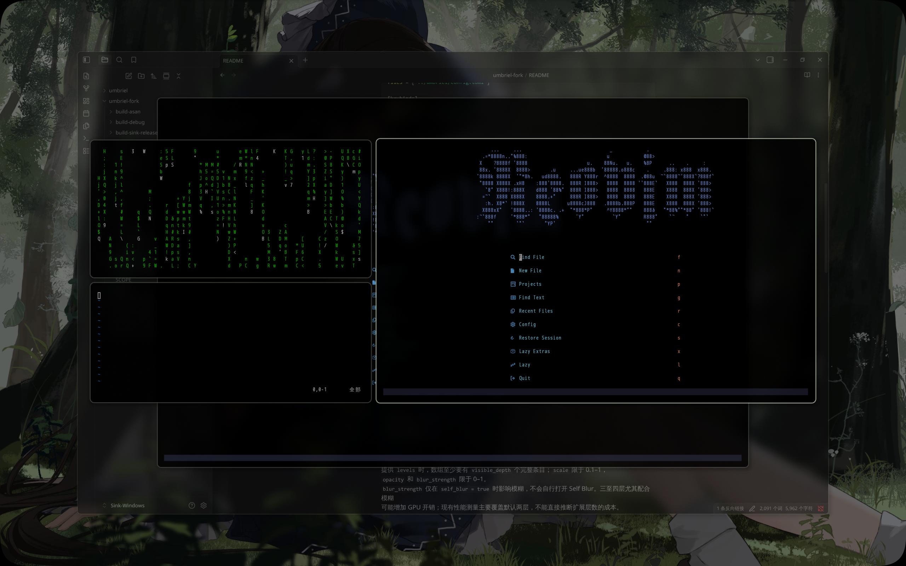

**Language / 语言:** [English](README.md) | [简体中文](README-CN.md)

# Umbriel Sink

Umbriel Sink is an experiment in tiled desktop interaction, inspired by [this talk on desktop UX](https://www.youtube.com/watch?v=V7AfAcQwLW0).
It explores a complement to tiling: how can a desktop preserve and represent the work context someone has just left,
letting it leave the active work surface without disappearing entirely from their cognitive space?

The project narrows that question to **suspending and resuming short-term work context**. It uses
[Umbriel](README-UMBRIEL.md) as an experimental platform and offers one concrete answer through a reversible
Sink/Pull depth stack. This is not an official Noctalia project; the upstream overview, standard build instructions,
and dependencies remain in [README-UMBRIEL.md](README-UMBRIEL.md).

> **AI involvement:** AI (OpenAI Codex) participated in writing and modifying this fork's Sink/Pull implementation,
> related tests and scripts, and this document. Please review it against your own hardware and workflow.
> The original upstream Umbriel code should not be attributed to this fork or to AI.

## What Sink does

- `window-sink` pushes the focused window onto its Workspace's stack; `window-pull` restores the most recently sunk
  window (last in, first out).
- A sunk window retains its underlying tiled or floating placement, applicable window states, and Workspace occupancy,
  but no longer receives ordinary input or focus. The compositor projects the whole window to express depth without
  asking the client to resize merely for the visual effect.
- The top two entries are visible by default: depth 0 uses `0.93` scale and `0.82` opacity; depth 1 uses `0.85`
  scale and `0.45` opacity. Deeper windows remain in the logical stack but are beyond the default visibility horizon.
- Pull returns the projection to its normal position and restores focus after a compatible client commit. Explicitly
  activating a sunk window, or selecting it in Overview, can unwind the stack through that window.
- `visible_depth` sets the number of visible layers from 1 to 4; `levels` controls each layer's scale, opacity,
  and Self Blur strength. Self Blur is optional and off by default.



## Quick start

After installing the separate session below, select **Umbriel Sink** at the login screen. An independently installed
official **Umbriel** session remains available. Building this repository alone does not update an installed session.

Add unused keybindings to the fork-only configuration at `~/.config/umbriel-sink/config.toml`, for example:

```toml
[include]
files = ["../umbriel/config.toml"]

[keybinds]
"Mod+Alt+Down" = "window-sink"
"Mod+Alt+Up" = "window-pull"
```

If you already have an upstream Umbriel config, the relative `include` inherits its theme, keybindings, and window
rules. Otherwise, remove `[include]` and start from the [full example config](examples/config.toml). Keep the new
Sink/Pull bindings in the fork-only file rather than a keybinding file shared by both sessions: upstream Umbriel does
not recognize these actions. These chords are only examples; check your existing bindings for conflicts.

You can also send the actions from a terminal in the separate session without binding keys:

```sh
~/.local/libexec/umbriel-sink/umbriel-sink msg window-sink
~/.local/libexec/umbriel-sink/umbriel-sink msg window-pull
~/.local/libexec/umbriel-sink/umbriel-sink windows --json
```

In `windows --json`, `sunk` and `sink_depth` describe logical state. `sink_depth = 0` is the top of the stack;
logical depth does not guarantee visibility. See the [actions](docs/user/actions.md) and [IPC](docs/user/ipc.md)
documentation for more detail.

## Visible depth and appearance

Add the following to the fork-only configuration. If it already has an `[appearance.sink]` table, add these keys to
that table instead of declaring it twice:

```toml
[appearance.sink]
visible_depth = 2
levels = [
  { scale = 0.93, opacity = 0.82, blur_strength = 0.5 },
  { scale = 0.85, opacity = 0.45, blur_strength = 1.0 },
]
self_blur = false
blur_radius = 6
blur_samples = 9
```

`visible_depth = 2` is the recommended default. Omitting `visible_depth` or `levels` also uses these built-in styles.
If you specify `levels`, provide at least `visible_depth` complete entries: `scale` must be between 0.1 and 1, while
`opacity` and `blur_strength` must be between 0 and 1. `blur_strength` matters only when `self_blur = true`; it does
not enable blur by itself. Showing three or four layers, especially with blur, can increase GPU cost. Existing
performance measurements mainly cover the default two-layer horizon, so they do not establish the cost of extra
layers. Validate and hot-reload changes with:

```sh
~/.local/libexec/umbriel-sink/umbriel-sink validate -c ~/.config/umbriel-sink/config.toml
~/.local/libexec/umbriel-sink/umbriel-sink msg config-reload
```

See the [appearance documentation](docs/user/appearance.md) for all defaults and limits.

## Build and separate session files

For a first build, see the upstream [README-UMBRIEL.md](README-UMBRIEL.md#building) for dependencies. The separate
session uses its own Release build; do not run `just install` to replace an official Umbriel installation:

```sh
meson setup build-sink-release --buildtype=release -Db_lto=true -Dtests=disabled -Dcpp_std=c++23 --prefix="$HOME/.local"
meson compile -C build-sink-release umbriel
```

If `build-sink-release/` already exists, only the second command is needed. Log out of a running Umbriel Sink session
before installing a new binary. These are suggested paths for a separate installation, not replacements for the
official session. 

| Repository file | Suggested installed location / purpose |
| --- | --- |
| `build-sink-release/umbriel` | `~/.local/libexec/umbriel-sink/umbriel-sink`, separate compositor binary |
| [`tools/sink-session/start-umbriel-sink`](tools/sink-session/start-umbriel-sink) | `~/.local/bin/start-umbriel-sink`, login launcher |
| [`tools/sink-session/umbriel-sink.service`](tools/sink-session/umbriel-sink.service) | `~/.config/systemd/user/umbriel-sink.service`, user service |
| [`tools/sink-session/umbriel-sink.desktop.in`](tools/sink-session/umbriel-sink.desktop.in) | Login entry template; the user's launcher path is filled in at install time |
| [`tools/sink-session/install-session-entry.sh`](tools/sink-session/install-session-entry.sh) | Renders the template and installs only the separate login entry with administrator privileges |
| Fork-only config | `~/.config/umbriel-sink/config.toml`, which may `include` an upstream config |

For a first installation, prepare the fork-only config above, then install the binary, launcher, and user service:

```sh
install -Dm755 build-sink-release/umbriel "$HOME/.local/libexec/umbriel-sink/umbriel-sink"
install -Dm755 tools/sink-session/start-umbriel-sink "$HOME/.local/bin/start-umbriel-sink"
install -Dm644 tools/sink-session/umbriel-sink.service "$HOME/.config/systemd/user/umbriel-sink.service"
systemctl --user daemon-reload
```

The login entry is generated from a template; no user's home path is stored in the repository. Preview the rendered
entry, then install it:

```sh
tools/sink-session/install-session-entry.sh --render
tools/sink-session/install-session-entry.sh
```

The script resolves the default launcher under `$HOME` and writes its path to the system session directory only at
install time. If your launcher lives elsewhere, pass its absolute path without spaces or special characters as an
argument. The script calls `sudo` but does not overwrite the official session entry. See
[`tools/sink-session/README.md`](tools/sink-session/README.md) for session isolation and path details. The separate
entry and service leave the official `umbriel.desktop`, `umbriel.service`, `start-umbriel`, and config untouched.

## Code, tests, and status

The Sink stack and projection are primarily implemented in `src/workspace/sink_stack.h`,
`src/workspace/sink_presentation.h`, `src/workspace/workspace.cpp`, and `src/scene/window_projection.*`.
Configuration parsing lives in `src/config/`; Self Blur rendering lives in `umbrielfx/`. Focused harness checks include
`tests/harness/checks/155_sink_logic.sh`, `156_sink_projection.sh`, `158_sink_self_blur.sh`, and
`159_sink_performance_matrix.sh`. The real-application smoke-test script is
[`tests/manual/sink_real_apps.sh`](tests/manual/sink_real_apps.sh).

```sh
just test debug
just check 155_sink_logic 156_sink_projection 158_sink_self_blur
```

The GPU harness needs an available DRM render node. A successful build or pure-logic unit test is not, by itself,
validation on a real GPU or native seat. The core Sink/Pull MVP is implemented; Self Blur and expanded visible depth
remain under personal evaluation and performance tuning. See [LICENSE](LICENSE) for the upstream license; changes in
this fork must also follow the repository license.
